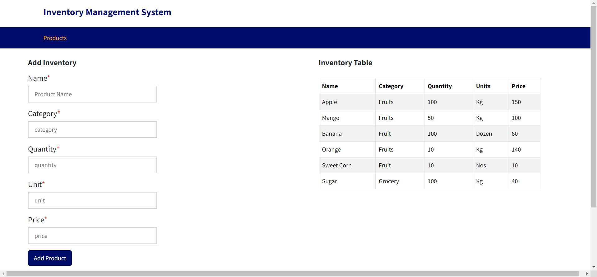

# Grocery Inventory Management System

This is a simple grocery inventory management system built using the MERN (MongoDB, Express.js, React.js, Node.js) stack. It allows you to add grocery items to the inventory and retrieve a list of all items.

## Getting Started

These instructions will help you set up and run the project on your local machine for development and testing purposes.

### Prerequisites

Before you begin, make sure you have the following software installed on your system:

- [Node.js](https://nodejs.org/)
- [MongoDB](https://www.mongodb.com/)

### Installation

1. Clone this repository to your local machine with git bash:

   git bash
   git clone https://github.com/AjayNavgire/inventory_management.git

### Navigate to the project directory
   cd inventory_management

### Install server dependencies
   cd backend
   npm install dotenv express mongoose nodemon 

### Install client dependencies
   cd ../frontend/inventory_app
   npm install

## Running the Application
   Open two terminal in vs code or any coding tool

### In first terminal Start the server:
### From the 'backend' directory
    cd ./backend
    npm start
    The server will run on http://localhost:4000.

### In Second terminal Start the React App:
### From the 'frontend' directory
    cd ./frontend/inventory_app
    npm start
    The React app will run on http://localhost:3000.

# Using the Application
You can add grocery items to the inventory by entering the item name and quantity in the input fields and clicking the "Add Product" button.

The added items will be displayed in a list side the input fields.

### Please check below image
This image show final UI views

# API Endpoints
 POST http://localhost:4000/api/v1/product/new : Adds a product item to the inventory.

 Example request body:
{
  "name"     : "Mango",
  "category" : "Fruits",
  "quantity" : 50,
  "unit"     : "Kg",
  "price"    : 100
}

 GET http://localhost:4000/api/v1/products : Retrieves a list of all product items in the inventory.

# Testing the Endpoints
You can use tools like Postman or curl to test the API endpoints manually.
